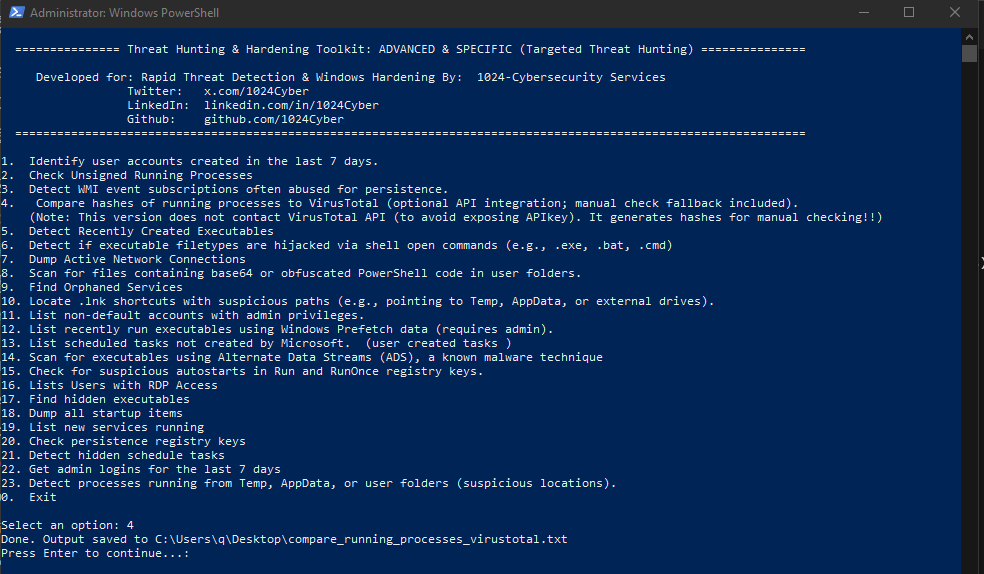
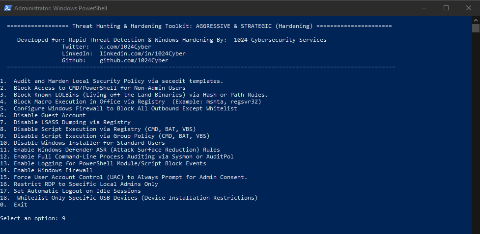

# 🛡️ Windows Hardening & Threat Hunting Toolkit  
### A Pentester's Point of View

This repository contains a curated collection of **PowerShell scripts** designed for **Windows system hardening** and **threat hunting**, based on real-world attack paths and defensive countermeasures. Whether you're a Blue Teamer, SOC Analyst, System Administrator, or Red Teamer thinking defensively — this toolkit helps you identify misconfigurations, trace malware artifacts, and proactively harden endpoints.

---

## 📁 Toolkit Structure

### 🔹 BASICS (Visibility & Hygiene)
1. List Hidden/System Files  
2. Recently Created Files  
3. Hidden Executables in AppData/ProgramData/User  
4. View Auto-Start Entries  
5. List Scheduled Tasks  
6. Listening Ports and Processes  
7. Check PowerShell History  
8. Check Active RDP Sessions  
9. Disable Autorun  
10. Disable Windows Script Host  
11. Disable Remote Desktop  
12. Re-enable Windows Defender  
13. Block PowerShell v2  
14. Find Weak File Permissions  

---

### 🔹 ADVANCED & SPECIFIC (Targeted Threat Hunting)
1. Identify Accounts Created in the Last 7 Days  
2. Check Unsigned Running Processes  
3. Detect WMI Event Subscriptions (Persistence)  
4. Compare Process Hashes to VirusTotal (Manual Check)  
5. Detect Recently Created Executables  
6. Detect Filetype Hijacks via Shell Open Commands  
7. Dump Active Network Connections  
8. Scan for Base64 or Obfuscated PowerShell in User Folders  
9. Find Orphaned Services  
10. Locate Suspicious LNK Shortcuts  
11. List Non-Default Admin Accounts  
12. List Recently Run Executables (Prefetch)  
13. List User-Created Scheduled Tasks  
14. Scan for Executables with Alternate Data Streams (ADS)  
15. Check Run/RunOnce Registry Autostarts  
16. List Users with RDP Access  
17. Find Hidden Executables in Key Directories  
18. Dump All Startup Items  
19. List New Services  
20. Check Registry-Based Persistence  
21. Detect Hidden Scheduled Tasks  
22. Get Admin Logins for Last 7 Days  
23. Detect Processes Running from Suspicious Directories (AppData, Temp, etc.)  

---

### 🔹 AGGRESSIVE & STRATEGIC (Hardening)  
1. Audit & Harden Local Security Policy via `secedit`  
2. Block CMD/PowerShell Access for Non-Admins  
3. Block Known LOLBins (Living off the Land Binaries)  
4. Block Office Macros via Registry  
5. Block All Outbound Connections Except Whitelist via Firewall  
6. Disable Guest Account  
7. Disable LSASS Dumping via Registry  
8. Disable Script Execution (CMD, BAT, VBS)  
9. Disable Script Execution via Group Policy  
10. Disable Windows Installer for Standard Users  
11. Enable Windows Defender ASR (Attack Surface Reduction)  
12. Enable Full Command-Line Auditing via Sysmon/AuditPol  
13. Enable PowerShell Script Block Logging  
14. Enable Windows Firewall  
15. Force UAC to Always Prompt for Consent  
16. Restrict RDP to Specific Local Admins Only  
17. Enable Auto Logout on Idle Sessions  
18. Whitelist USB Devices via Device Installation Restrictions  

PS: Only use this section if you know what you are doing!!
---

## 🚀 How to Use

- Each script is self-contained and outputs results to a `.txt` file on your **Desktop** using its filename.
- The toolkit includes an **interactive PowerShell menu** to easily navigate and execute 

✅ When downloading from the internet, Windows blocks .ps1 files. You must unblock them:
To unblock and make this scripts run Powershell as administrator and folllow the steps below

1.  Run this PowerShell command after unzipping:
  Get-ChildItem -Path "C:\Path\To\Folder" -Filter *.ps1 | Unblock-File

2. Allow PowerShell Script Execution Temporarily
By default, PowerShell blocks custom scripts. To allow them only for this session:
   Set-ExecutionPolicy -ExecutionPolicy Bypass -Scope Process -Force

Alternatively, to make it permanent system-wide (not recommended on production systems):
   Set-ExecutionPolicy RemoteSigned -Scope CurrentUser

 3. Run the Interactive Menu Script
After unblocking and setting execution policy, launch the menu:
   cd "C:\Path\To\Toolkit"
   .\_interactive_menu_for_phase_I.ps1

4. Run Individual Scripts Manually
To run any script directly without the interactive menu, example:
.\re-enable_windows_defender.ps1

---

### 📸 Screenshots

<h4>🔧 BASICS (Visibility & Hygiene) Interactive Menu</h4>

<h5>🔧 ADVANCED & SPECIFIC (Targeted Threat Hunting) Interactive Menu</h5>

<h6>🔧 AGGRESSIVE & STRATEGIC (Hardening) Interactive Menu</h6>

---

⚠️ Legal & Ethical Disclaimer
This toolkit is intended for educational and defensive purposes only.
Do not use on systems you do not own or have explicit permission to test.
The author assumes no liability for misuse or damages.

---

🙌 Credits
Developed and maintained by 1024-Cybersecurity Services

Linkedin: https://linkedin.com/in/1024Cyber
X:         https://x.com/1024Cyber
Github:    https://github.com/1024Cyber
Telegram Channel:  https://t.me/+tNHGAz8EWk1mM2Jk

Inspired by real-world offensive tradecraft and blue team detection strategies.

